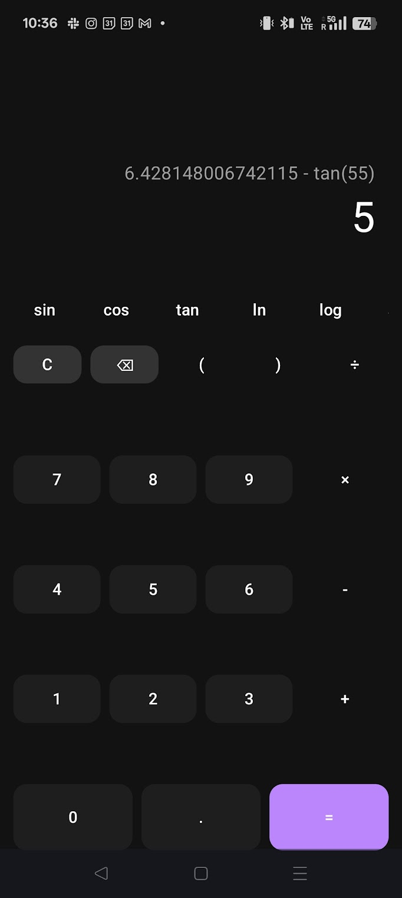

# XPC-MMA Scientific Calculator

A minimal Android scientific calculator built with Kotlin and Jetpack Compose. University course project (MVVM, Material3 dark theme).

## Features

- **Basic:** digits, operators (+, −, ×, ÷), equals, clear, backspace, decimal
- **Scientific:** sin, cos, tan (degrees), ln, log, parentheses

## Tech Stack

- Kotlin · Jetpack Compose · Material3 · MVVM